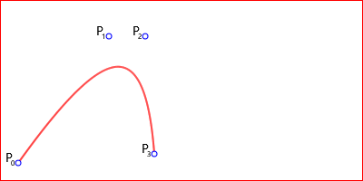
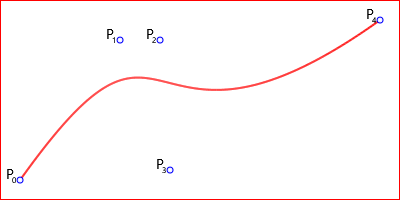
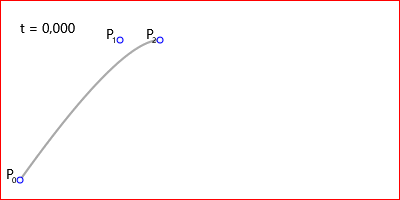
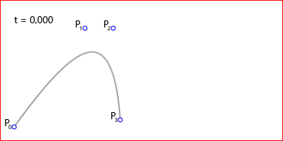
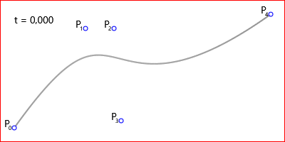
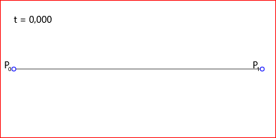
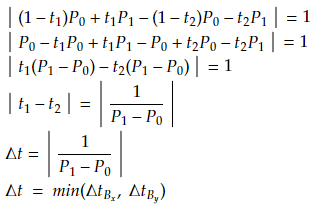

# Алгоритмы — Кривые Безье

1. [Введение](#1-введение)
2. [Кривая Безье](#2-кривая-безье)
3. [Геометрическое объяснение Кривых Безье Поля де Кастельжо](#3-геометрическое-объяснение-кривых-безье-поля-де-кастельжо)
4. [Уровень дискретизации t](#4-уровень-дискретизации-t)
5. [Заключение](#5-заключение)

## 1. Введение

Кривы́е Безье́ — типы кривых, предложенные в 60-х годах XX века независимо друг от друга Пьером Безье из автомобилестроительной компании «Рено» и Полем де Кастельжо из компании «Ситроен», где применялись для проектирования кузовов автомобилей.

Поле де Кастельжо предложил их геометрическое рекурсивное обоснование. Пьер Безье предложил только их математическую формулировку.

Кривая Безье является частным случаем многочленов Бернштейна, описанных Сергеем Натановичем Бернштейном в 1912 году.

## 2. Кривая Безье

Кривая Безье записывается следующим параметрическим выражением:

*t* — изменяется от 0 до 1, вещественное, точность его определяется в зависимости от разрешения монитора и уровня дискретизации.

Далее приводятся примеры уравнений кривых от 1-го до 3-го порядка.

Уравнение Кривой Безье 1-го порядка:

Уравнение кривой Безье 2-го порядка:

Уравнение кривой Безье 3-го порядка:

На рисунках 1-4 представлены Кривые Безье с точками:

построенными на поле шириной 400 точек и высотой 200 точек.

*Рис. 1. Линейная кривая Безье.*

*Рис. 2. Квадратичная кривая Безье.*

*Рис. 3. Кубическая кривая Безье.*

*Рис. 4. Кривая Безье 4-го порядка.*

Далее посмотрим на анимацию построения кривых Безье (точка t плавно двигается по кривой).

*Анимация. 1. Линейная кривая Безье.*

*Анимация. 2. Квадратичная кривая Безье.*

*Анимация. 3. Кубическая кривая Безье.*

*Анимация. 4. Кривая Безье 4-го порядка.*

## 3. Геометрическое объяснение Кривых Безье Поля де Кастельжо

Строим линейные Кривые Безье от первой точки до второй, от второй к третьей и так до последней, не соединяя линейной Кривой Безье последнюю и 0-ую точку. Через точки t (полученных ранее линейных кривых) строим линейные Кривые Безье начиная с нулевой и до последней, как ранее, но уже по полученным точкам, которых на одну меньше, чем ранее. Снова строим через новополученные точки t линейные кривые и из них получаем новые точки. Так повторяем пока точка не останется одна — это и есть точка кривой. Теперь представьте всё это в движении — это и есть Кривая Безье. Наглядно посмотрите на анимации далее.

Построение Кривой Безье 1-го порядка:

*Анимация 5. Геометрический смысл линейной Кривой Безье.*

Построение Кривой Безье 2-го порядка:

Анимация 6. Геометрический смысл квадратичной Кривой Безье.

Построение Кривой Безье 3-го порядка:

*Анимация 7. Геометрический смысл кубической Кривой Безье.*

Построение Кривой Безье 4-го порядка:

*Анимация 8. Геометрический смысл Кривой Безье 4-го порядка.*

В заключение раздела предоставляю исходный код программы для рисования описанных выше рисунков: [Программа для рисования Кривых Безье, без учёта уровня дискретизации t (версия .NET 4.7.2)](https://github.com/DmitriySidyakin/Blog-ComputerGraphics/tree/master/Bezier/BezierSolution).
Программа написана на C# WPF, программа генерирует картинки попиксельно на холсте пикселей со сглаживанием с помощью сверх образца x16). Программа записывает картинки в корень расположения исполняемого файла.

## 4. Уровень дискретизации t

Для определения уровня дискретизации t координаты x или y, для всех случаев с определённым t, должны отличаться на единицу. Т.е.:

Уравнение выглядит так, более конкретно:

Т.е.:

Решим это уравнение для линейной кривой:

Это уравнение Δt действительно для уравнения только кривой Безье первого порядка (n=1), хотя для неё бессмысленно начальное утверждение, но оно подойдёт Вам для многочленов Безье большего порядка. В конце показано, что выбирается минимальное Δt, но можно использовать и для конкретной оси.

Выведите уравнение для Δt для общего случая самостоятельно, если вы планируете написать свой графический редактор, то сделайте это обязательно.

## 5. Заключение

В заключение статьи могу Вам пожелать написание собственного графического редактора или другого применения Кривых Безье.

