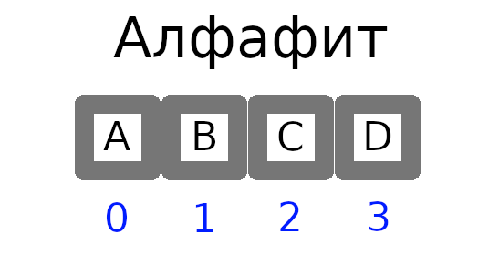

[Главная](https://dmitriysidyakin.github.io/School-IT/) >> [Алгоритмы](https://dmitriysidyakin.github.io/School-IT/csharp-articles/ru-ru/algorithms-on-csharp/)

# Комбинаторика. Полный перебор по алфавиту

Сразу хочу сказать, что алгоритм приведён в информационных целях и его нельзя использовать для взлома паролей.

Алгоритм построен на том, что есть определённый алфавит. К примеру: ['A', 'B', 'C', 'D'].
С кодами: A = 0, B = 1, C = 2, D = 3.

*Рис. 1. Алфавит.*

В алфавите буквы пронумерованы. К примеру, от нуля. Пусть у нас есть массив алфавита с элементами x=>y (индекс x соответствует символу y). Массив алфавита: [0=>"A", 1=>"B", 2 => "C", 3 => "D"]. Рассмотрим на примере этого алфавита пример полного перебора по алфавиту.

*Анимация. 1. Пример алгоритма полного перебора по алфавиту, без расширения границ при переполнении.*

Примеры значений шагов алгоритма:

*Таблица 1. Пример шагов алгоритма.*

| Шаг	| Значения индексов	| Буква по индесу |
|-------|-------------------|-----------------|
| 1	    | 0000	            | AAAA            |
| 2	    | 0001	            | AAAB            |
| 3	    | 0002	            | AAAC            |
| 4	    | 0003	            | AAAD            |
| 5	    | 0010	            | AABA            |
| 6	    | 0011	            | AABB            |
| ...   | ...	            | ....            |
| X	    | 2330	            | CDDA            |
| X+1	| 2331	            | CDDB            |
| ...   | ...	            | ...             |
| N-1	| 3332	            | DDDC            |
| N	    | 3333	            | DDDD            |

Шаги алгоритма получения следующего элемента:

- Входные данные: алфавит, минимальное значение, максимальное значение.
- В конструкторе инициализируем начальное значение массива текущего элемента — value.
1. В массиве value содержаться индексы элементов алфавита. Увеличивываем на один значение первого элемента в массиве.
2. В цикле просматривываем каждый элемент массива value с первого элемента:
	2.1. Если значение элемента массива больше последнего элемента, то сбрасывываем его значение на нуль и увеличивываем значение следующего элемента на один.
	2.2. Переходим к следующему элементу и проделывываем для него пункт 2.1.
	2.3. Если при посмотре текущего последнего элемента массива value не хватило элемента для переноса, то просто создаём этот элемент.
	
## Преимущества и Недостатки

Не используйте данный алгоритм для взлома паролей.

Преимущества:

- Хороший алгоритм для тестирования, для генерации всех входных значений.

Недостатки:

- Даёт возможность атаки на систему с помощью полного перебора по алфавиту, к примеру, паролей.

## Исходный код

Пример полного перебора по алфавиту на языке C# расположен [тут](https://github.com/DmitriySidyakin/School-IT/tree/main/csharp-articles/ru-ru/algorithms-on-csharp/articles/0003-Brute-force-sample/BruteForceSample).
